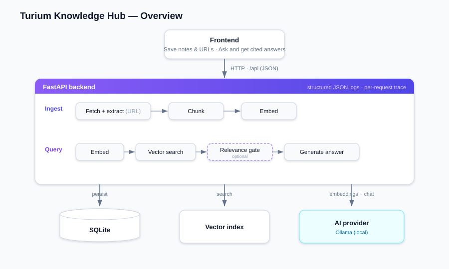

# Turium Knowledge Hub

**Stack:** Python · FastAPI · SQLite · NumPy · React/TypeScript/Vite · local LLM via Ollama.

> **Provider note (for reviewers).** This project was built, run, and evaluated **entirely on local models via [Ollama](https://ollama.com)** — `nomic-embed-text` (embeddings) and `qwen2.5:7b-instruct` (answers). **OpenAI is wired in behind the same interface but was _not_ tested** (no API key was used). Switching to OpenAI is a config-only change (see [Setup](#config-that-matters-backendenv)).

---

## 1. Setup

### Prerequisites

- **[Ollama](https://ollama.com)** running locally, with both models pulled:
  ```bash
  ollama pull nomic-embed-text        # embeddings (768-dim)
  ollama pull qwen2.5:7b-instruct     # answers (+ optional relevance gate) (~4.7 GB)
  ```
- **Node 20.19+** (for Vite 8).
- **Python 3.13** with **[uv](https://docs.astral.sh/uv/)** (or plain `venv` + `pip` — fallback below).

### Backend

```bash
cd backend
uv sync                                  # create .venv from uv.lock
cp .env.example .env
uv run uvicorn app.main:app --reload     # http://127.0.0.1:8000  (API docs at /docs)
```

<details>
<summary>No <code>uv</code>? Use the stdlib venv instead</summary>

```bash
cd backend
python -m venv .venv && source .venv/Scripts/activate   # ...\Scripts\activate on Windows
pip install -e .
cp .env.example .env
uvicorn app.main:app --reload
```
</details>

The ASGI app object is `app` in `app/main.py` — the target is `app.main:app`.
`GET /health` reports the live provider, e.g. `ollama:qwen2.5:7b-instruct`.

### Frontend

```bash
cd frontend
npm install
npm run dev                              # http://localhost:5173
```

The dev server proxies `/api/*` to the backend, so no CORS setup is needed locally.

### Config that matters (`backend/.env`)

| Key | Default | Purpose |
|---|---|---|
| `AI_PROVIDER` | `ollama` | `ollama` (local, no key) or `openai` (needs `OPENAI_API_KEY`) |
| `RELEVANCE_GATE` | `false` | Optional LLM yes/no check that context answers the question, run before generating (one extra call/query). Turn on to reject out-of-scope questions — see [Evaluation](#3-evaluation). |
| `MIN_RELEVANCE_SCORE` | `0.05` | Cosine floor for dropping weak chunks |
| `TOP_K` | `4` | Chunks retrieved per query |
| `CHUNK_SIZE` / `CHUNK_OVERLAP` | `800` / `150` | Chunking window |

Switching to OpenAI is config-only (same adapter, different base URL):
```env
AI_PROVIDER=openai
OPENAI_API_KEY=sk-...
```

---

## 2. Architecture



<sub>Editable source: [`docs/architecture.drawio`](docs/architecture.drawio) — open in [diagrams.net](https://app.diagrams.net) or the VS Code *Draw.io Integration* extension.</sub>

The backend follows a **ports-and-adapters (hexagonal)** layout: the core (domain + services) depends only on interfaces, so the AI provider, storage, and HTTP client plug in at the edges — swappable and testable with no key or network.

**Layers**

```
backend/app/
├── domain/         entities, PORT INTERFACES, DTOs, errors   (no framework deps)
├── providers/      ADAPTER: OpenAI-protocol embeddings + chat, selection factory
├── repositories/   ADAPTER: SqliteItemRepository (SQL) + VectorIndex (search)
├── services/       USE-CASES: chunking, fetch, ingest, retrieval, rag, prompt
├── api/            thin HTTP: routes, DI wiring, error→status mapping
├── observability/  ContextVar tracer + trace middleware
├── container.py    COMPOSITION ROOT — the one place the graph is wired
└── main.py         app factory + lifespan (rebuilds VectorIndex from SQLite)
```

### Design decisions and tradeoffs

**Storage and search.** SQLite is the durable store. Retrieval runs in memory: embeddings sit in a normalised NumPy matrix, and each query is scored with one matrix-vector product. This is fast and needs no extra services.
*Tradeoff:* the whole index lives in memory, so it must fit in RAM and is rebuilt from SQLite on startup, and because every query scores against all chunks, search cost grows linearly with the corpus.

**Chunking.** Documents are split into fixed-size character windows with overlap, and each boundary is moved to the nearest paragraph or sentence break. This keeps context across boundaries and avoids cutting mid-sentence.
*Tradeoff:* fixed-size windows are not semantically aware, so a chunk can still split a coherent section, and the overlap stores some text more than once.

**AI provider.** The default is a local model via Ollama: no API key, and data stays on the machine. Ollama speaks the OpenAI API, so one adapter covers both backends and the provider is a config switch.
*Note:* OpenAI works through the same interface but was not tested for this submission.

**Out-of-scope questions.** A cosine threshold cannot reliably separate unrelated questions from weakly-worded valid ones, because their scores overlap. An optional relevance gate asks the model whether the context actually answers the question before generating.
*Tradeoff:* it adds one model call per query, so it ships off by default. Enabled, it rejects out-of-scope questions at the cost of the occasional false decline (see Evaluation). It fails open, so a bad verdict never drops a valid answer.

**URL ingestion.** Fetching user-supplied URLs server-side is an SSRF risk. Redirects are followed manually, and every hop is rejected if it resolves to a private, loopback, or link-local address. Non-HTTP schemes are refused and the body is capped while streaming.

**Write ordering.** On ingest, SQLite is written before the in-memory index, so a failed write cannot leave the index holding chunks that were never saved.

**Known limits.** Ingestion is synchronous: the request blocks while the URL is fetched and embedded. SQLite also serialises writes to a single writer at a time. Both are acceptable for a single-user tool.

---

## 3. Evaluation

RAG has **two independent failure modes** (retrieval and generation), plus out-of-scope robustness — measured separately against labelled golden sets. The harness reuses the **real** `Container`/services against the configured provider, so it exercises the actual pipeline.

```bash
cd backend
uv run python -m evaluation.evaluate                         # easy set
uv run python -m evaluation.evaluate golden_set_hard.json    # hard set
```

- `golden_set.json` — 8 short docs, single-source questions.
- `golden_set_hard.json` — 10 long docs with **overlapping vocabulary (distractors)** and hard queries: comparative, multi-hop synthesis over 2–3 sources, negation, keyword-free paraphrases.

**Metrics** — *Retrieval:* Hit@1/3/5, MRR, context-recall@k, all-sources-hit@k. *Generation:* cites-expected (any/all), lexical groundedness, LLM-as-judge faithfulness + relevance (1–5). *Robustness:* correct-rejection rate on out-of-scope questions.

**Results** (hard set, `nomic-embed-text` + `qwen2.5:7b-instruct`, `top_k=4`, with the optional relevance gate **enabled**):

| Hit@1 | MRR | Ctx recall@6 | All-sources@6 | Cites ≥1 | Cites all | Faithful | Relevant | Reject |
|---|---|---|---|---|---|---|---|---|
| 94% | 0.97 | 100% | 100% | 94% | 78% | 4.33/5 | 4.56/5 | 3/3 |

**What this shows**

- **Retrieval is robust to distractors and multi-hop.** Every required source was retrieved (recall & all-sources = 100% @k=6) even for 2–3-source synthesis questions; answers stayed grounded (faithfulness 4.33/5).
- **Out-of-scope rejection is opt-in.** A cosine floor alone can't reject out-of-scope questions (unrelated scores overlap valid weak ones), so with the default `RELEVANCE_GATE=false` they slip through (**0/3** rejected). Enabling the **LLM relevance gate** (`RELEVANCE_GATE=true`, the run shown above) takes this to **3/3**, at the cost of one extra LLM call per query and one oblique paraphrase ("image vs container") also being declined. It ships off by default; turn it on when rejecting out-of-scope questions matters more than latency.
- **Cites-all (78%) is `answer_k`-bounded**, not a retrieval miss: with 4 chunks sent, a 3-source question can't cite 3 distinct docs. Raising `EVAL_ANSWER_K` lifts it. Emitting the `[Source N]` ids the model actually used is the open citation-precision item.

---

## API reference

Base URL `http://127.0.0.1:8000` · interactive docs at `/docs`.

| Method | Path | Purpose |
|---|---|---|
| `POST` | `/ingest` | Save a note **or** fetch+save a URL (exactly one of `text`/`url`) → `201` |
| `GET` | `/items` | List saved items, newest first |
| `GET` | `/items/{id}` | One item with full content (`404` if missing) |
| `PATCH` | `/items/{id}` | Edit title/content; a content edit re-chunks + re-embeds |
| `DELETE` | `/items/{id}` | Delete item + chunks + index entries → `204` |
| `POST` | `/query` | Ask a question over saved content (optional `top_k`) |
| `GET` | `/health` | Liveness, active providers, index size |

```jsonc
// POST /query  →  200
{ "question": "...", "answer": "... [Source 1]",
  "citations": [ { "item_id": "...", "title": "...", "source_type": "note",
                   "source_url": null, "snippet": "..." } ] }
// Declined (out-of-scope): citations is [] and answer is the no-answer message.
```

> The internal cosine **score is not exposed** in API responses — it stays in logs and the debug trace. A declined query returns `200` with empty `citations`.

**Error envelope** — every failure, one shape:
```jsonc
{ "error": { "type": "ContentFetchError", "message": "URL returned HTTP 404." } }
```
`422` invalid input · `404` not found · `409` empty knowledge base · `400` bad/unfetchable URL · `502` provider failure · `500` unexpected.

---

## Observability

Structured single-line JSON logs, one `trace_id` per request stamped on every line (`grep` a whole request's flow). Each request logs its **query text** and per-stage spans (`query → embed_query → retrieve → filter → gate → generate → answer`) with timings, scores, and the gate verdict.

---

## Testing

```bash
cd backend && uv run pytest        # offline: fake providers + in-memory DB
```

Covers chunking, the ingest→retrieve→answer flow, index rebuild from storage, item CRUD, provider selection, the relevance gate (incl. multi-source synthesis), the HTTP API and error envelope, and the SSRF/failure paths.
